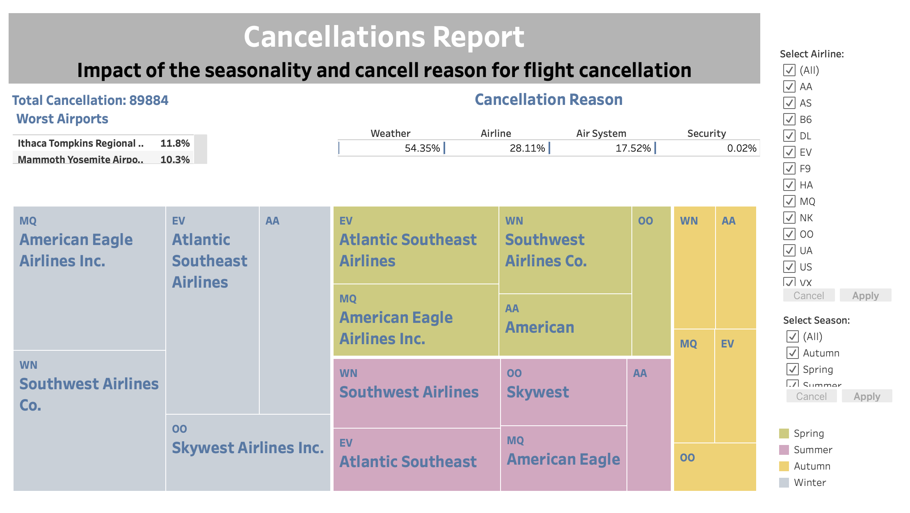
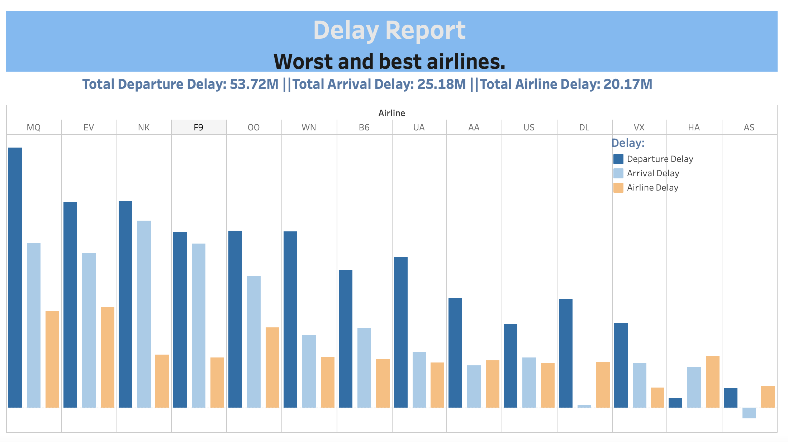
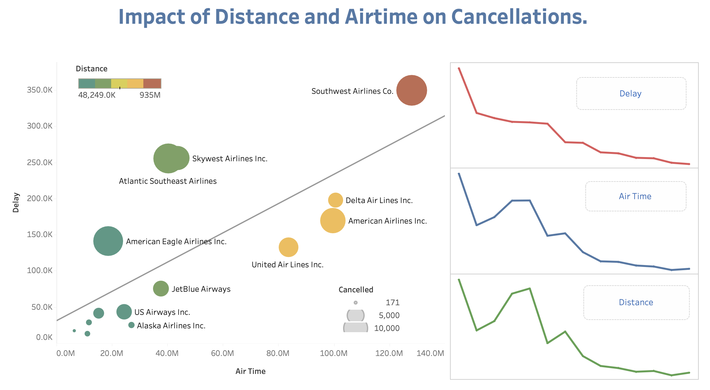

# flights-analysis

# Project Tableau course Flights Analysis – Ganna Tsatskina
https://public.tableau.com/views/FlightsAnaysis/Flights2?:language=en- US&:display_count=n&:origin=viz_share_link
1. Insight no.1
- Link - inside the story, the first dashboard in the story – Cancellation Report.
     Summary- Here we have a heatmap chart showing the densities cancellation
 
among 5 worst airlines during different seasons. We can identify reasons patterns within flights cancellations. A tooltip appears when you hover over an airline with bar chart showing cancellation reasons in percent for every airline.
  It is easy to see on the heatmap that the largest number of flight cancellations
occurs in winter.
We can make conclusion that the most common reason for cancellations –
  54.3% is weather conditions. Airlines cases determine 28.1% of all cancellations. The fewest cancellations create security reasons
According to the airports we can see that the worst origin airports are Ithaca Tompkins Regional Airport (11.8% of total number of flights) and Mammoth Yosemite Airport (10.3%)
American Eagle Airlines and Southwest Airlines Co have more cancellations in compare with other airlines – 10.4% and 10.2% respectively. Weather conditions explain 69% and 72.6% cancellations for this companies.
We also used two dynamic filters:
Select season – we get information connected with airlines according to different seasons,
Select airline – we can see frequency of cancellations over every season for chosen company.
 
Design - Using the heatmap, I searched for clusters of airlines cancellations
 with similar properties. I chose the heatmap for the most visual display of reasons that impact the indicator of interest. All colors are appropriate for color-blind people.

2. Insight no.2
 
Link - inside the story, the second dashboard in the story – Delay Report.
 Worst airlines.
 Summary- We have created a dynamic dashboard that shows the
   
frequencies of delays among the airlines given in thousands of minutes and correlation of delays with air time and distance of the flights. Bar charts is showing that the worst companies are American Eagle Airlines Inc. and Atlantic Southeast Airlines.
   
Design - Bar charts are useful for showing categories with corresponding
 
numerical values, so each airline and rates of delays are shown. Line charts display correlation between aggregated values. All colors are appropriate for color-blind people.

1. Insight no.3

 Link - inside the story, the third dashboard in the story – Impact of Distance
 and Airtime on Cancellations.
 Summary – We can dive some deeper into influences on flight cancellations.

Whether are distance and airtime rates cancellations through airlines?
These graphs show that flight cancellation is proportional to the distance and
  flight time. The line graphs represent the general trends to infer the existence of a correlation between delay and both flight distance and length of the flight time. The scatter chart highlights that Southwest Airlines Co has large amount of delay and cancellations while total distance of flights and flight time length also the greatest. By adding trend line, we can see the presence of a correlation between these values.

moving of values. Size of scatter plot dots shows amount of cancellation. The color intensity (deep orange – largest, green – smallest) highlights length distance of flights. Scatter plot distributed between axes with Air Time (X- axes) and departure delay (Y-axes). Trend line helps realize correlation. All colors are appropriate for color-blind people.
Design - Using line charts placed one below the other is easy way to see

 **Resources - N/A**
 

